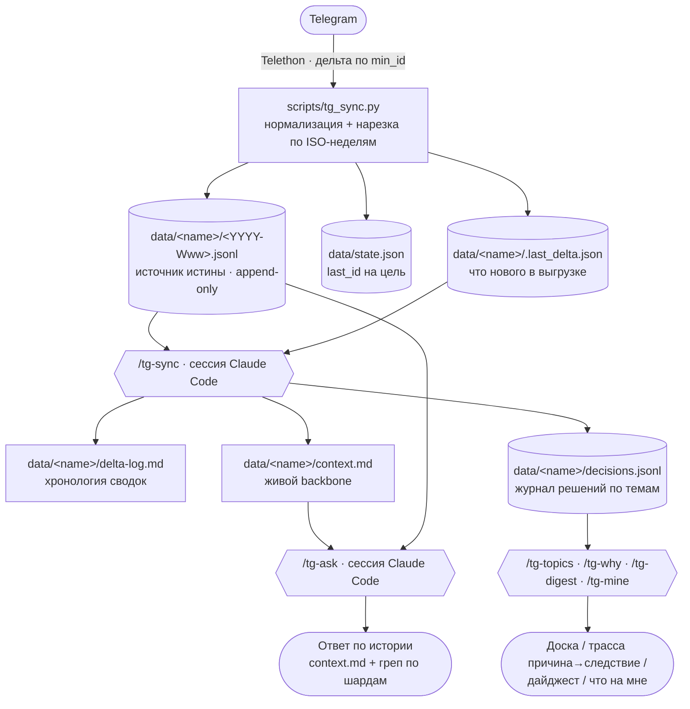

# Telegram Chat Digest

Следит за выбранными чатами Telegram, инкрементально выгружает **только новые**
сообщения и силами сессии **Claude Code** ведёт по каждому чату живую память:
хронологию, общий контекст и **журнал решений по темам** — а затем отвечает на
вопросы по истории. Отдельный LLM-API-ключ не нужен — суммаризацию, Q&A и разбор
решений делает агент через слэш-команды.

Главная ценность — легковесно, без поддержки, **понимать суть рабочих задач и
причину → следствие принятых решений по темам** для любых чатов, за которыми
хочется держать «связную память»: рабочие группы, комьюнити, проектные обсуждения.

## Что умеет

- **Дайджест дельты** — на каждом запуске тянет новые сообщения и дописывает
  хронологию изменений (`delta-log.md`) по каждому чату.
- **Живой контекст** — поддерживает `context.md`: участники, активные темы,
  принятые решения, открытые вопросы, договорённости. Backbone для ответов.
- **Журнал решений** — структурный `decisions.jsonl`: по каждой теме что решили,
  **почему** (причина), **что вышло** (следствие), статус и ответственный.
- **Q&A по истории** — ответы по `context.md` и точечному грепу сырых сообщений,
  со ссылками на `#id`.
- **Обзор активности** — таблица по всем группам за N дней (кто активен,
  упоминания вас, ответы) — чтобы решить, какие чаты взять в отслеживание.

## Как это устроено



Раскладка репозитория:

```text
config.yaml            список целей (чат, топик)
.env                   секреты Telegram (не в git)
secrets/tg.session     сессия Telethon (не в git)
scripts/
  shards.py            общий модуль недельного шардинга (ISO-неделя, чтение/запись JSONL)
  decisions.py         журнал решений по темам: свёртка, доска, причина→следствие, owner
  tg_digest.py         обзор движения решений за период + что «зависло»
  tg_sync.py           выгрузка дельты -> недельные шарды + state.json + .last_delta.json
  tg_overview.py       обзор активных групп за N дней (--days)
  tg_discover.py       N последних диалогов -> config.discovered.yaml (кандидаты в цели)
  import_export.py     разовый сидинг из ручного экспорта Telegram Desktop
  migrate_to_weekly.py разовая миграция старого raw.jsonl -> недельные шарды
.claude/commands/      слэш-команды (агентский слой)
tests/                 pytest на фикстурах (без сети/Telegram)
data/                  рантайм-данные, НЕ в git (формат см. в examples/)
examples/team-platform/ синтетический пример всех артефактов (вымышленные данные)
```

## Модель данных

- **Сообщения** — append-only JSONL по паре **(чат, топик)**, нарезка на **недельные
  шарды** `data/<name>/<YYYY-Www>.jsonl` по ISO-неделе даты сообщения (UTC). Одна
  дельта на стыке недель пишется сразу в два файла. Это источник истины.
- **Аналитика** — eager: на каждом sync дописывается `delta-log.md` (хронология),
  мерджится `context.md` (общий контекст) и дозаписывается `decisions.jsonl`
  (журнал решений/задач — append-only event-log, сворачиваемый в текущее состояние).
- **Только новые сообщения** — дельта по `min_id`; правки/удаления/реакции после
  выгрузки сознательно не догоняем (учитывайте при вопросах об актуальности).

Формат всех артефактов на живом (вымышленном) примере — в
[`examples/team-platform/`](examples/team-platform/).

## Установка (один раз)

1. Зависимости:

   ```bash
   python3 -m venv .venv && source .venv/bin/activate
   pip install -r requirements.txt      # или: pip install -e .
   ```

2. Получите `api_id` / `api_hash` на <https://my.telegram.org> → *API development tools*.
3. Скопируйте секреты и заполните:

   ```bash
   cp .env.example .env      # впишите TG_API_ID, TG_API_HASH, TG_PHONE
   ```

4. Пропишите свои чаты в `config.yaml` (поле `chat` принимает `@username`,
   числовой id или точное название чата; `topic` — id корневого сообщения топика
   или `null`). Опционально поле `me:` — ваше имя/@handle для команды `/tg-mine`.
5. Первый запуск выполнит интерактивный логин (код из Telegram, при необходимости
   2FA). Запускайте **питоном из venv** (иначе `ModuleNotFoundError: telethon`):

   ```bash
   .venv/bin/python scripts/tg_sync.py
   ```

   Сессия сохранится в `secrets/tg.session`, дальше логин не нужен.

> Опционально историю за прошлый период можно засеять из ручного экспорта
> Telegram Desktop (`scripts/import_export.py`) — тогда `last_id` проставится и
> первая выгрузка подтянет только новые сообщения.

## Использование

В сессии Claude Code в этой папке:

- `/tg-sync` — выгрузить новые сообщения и обновить `delta-log.md`, `context.md`
  и журнал решений `decisions.jsonl` (тема · причина · следствие · статус · ответственный).
- `/tg-ask <вопрос>` — ответ по истории (Claude читает `context.md` как backbone и
  при необходимости грепает недельные шарды `data/<name>/*.jsonl`).
- `/tg-topics` — доска решений и задач по темам (суть рабочих задач с одного взгляда).
- `/tg-why <тема>` — цепочка **причина → решение → следствие** по теме с цитатами `#id`.
- `/tg-digest [дней]` — что сдвинулось за период (новое/обновлённое/завершённое) и
  что **зависло** (open без движения).
- `/tg-mine [кто]` — активные решения/задачи на человеке («что на мне / на нём»).
- `/tg-overview` — обзор всех групп, активных за последние N дней (`--days`, по
  умолчанию 7). Таблица сохраняется в `data/_overview.md`.
- `/tg-discover [N]` — N последних диалогов (по умолчанию 20) в
  `config.discovered.yaml` закомментированными целями; раскомментируйте нужные и
  перенесите в `config.yaml`. Файл в `.gitignore`.

Команды `/tg-topics`, `/tg-why`, `/tg-digest`, `/tg-mine` опираются на модули
`scripts/decisions.py` и `scripts/tg_digest.py` — чистый Python без сети, поэтому
их детерминированную часть можно запускать и системным `python3`.

### Миграция со старого формата

Если остались данные в едином `data/<name>/raw.jsonl` (прежний формат), разрежьте
их на недельные шарды:

```bash
python3 scripts/migrate_to_weekly.py --dry-run   # показать план
python3 scripts/migrate_to_weekly.py             # выполнить (оригинал -> raw.jsonl.migrated)
```

## Разработка

Гейт качества — линт, формат, типы, тесты — собран одной командой и используется
и локально, и в CI:

```bash
pip install -r requirements-dev.txt   # ruff, mypy, pytest, types-PyYAML
make check                            # = ruff check . + ruff format --check . + mypy scripts + pytest
```

CI (GitHub Actions, `.github/workflows/ci.yml`) гоняет `make check` на каждый
push и pull request. Тесты чистые — без сети и Telegram (telethon в CI не нужен);
доменная логика (`shards`, `decisions`, `tg_digest`) покрыта юнит-тестами на
фикстурах в `tests/`.

## Безопасность данных

- `.env`, `secrets/`, `*.session` и **вся папка `data/`** — в `.gitignore`: это
  личные данные (сырые сообщения и производный от них контекст). В git попадает
  только синтетический `examples/`.
- User-session = ваш личный аккаунт Telegram: не коммитьте сессию, держите
  умеренную частоту запусков (FloodWait Telethon обрабатывает автоматически).
- В `.env.example` — только плейсхолдеры; реальные `api_id`/`api_hash`/телефон
  держите в `.env` (он не версионируется).

## Карта проекта (для агентов)

Короткие операционные правила — в [`AGENTS.md`](AGENTS.md). Ниже — ядро и инварианты.

| Модуль | Роль |
|---|---|
| `scripts/shards.py` | Недельный шардинг: `iso_week_of`, бакетизация, чтение/запись JSONL. Единый источник логики. |
| `scripts/decisions.py` | Журнал решений по темам: свёртка event-log → состояние, доска, причина→следствие, owner. |
| `scripts/tg_digest.py` | Обзор движения решений за период + детектор «зависшего». |
| `scripts/tg_sync.py` | Инкрементальная выгрузка дельты по `min_id`; нарезка по шардам; `state.json`, `.last_delta.json`. |
| `scripts/tg_overview.py` | Обзор активных групп за N дней (`--days`) с метриками. |
| `scripts/tg_discover.py` | N последних диалогов → `config.discovered.yaml` (кандидаты в цели). |
| `scripts/import_export.py` | Разовый сидинг из экспорта Telegram Desktop в недельные шарды. |
| `scripts/migrate_to_weekly.py` | Разовая миграция старого `raw.jsonl` → недельные шарды. |
| `.claude/commands/*.md` | Агентский слой: `/tg-sync`, `/tg-ask`, `/tg-topics`, `/tg-why`, `/tg-digest`, `/tg-mine`, `/tg-overview`, `/tg-discover`. |
| `config.yaml` | Список целей (чат, топик) + параметры выгрузки. |

**Инварианты — не нарушать:**

1. Реальные данные и секреты не версионируются (`data/`, `.env`, `secrets/`, `*.session`).
2. `*.jsonl` — append-only; недельная нарезка по ISO-неделе даты сообщения (UTC); единый `raw.jsonl` не возвращаем.
3. Только новые сообщения (дельта по `min_id`); правки/удаления не догоняем.
4. `context.md` мерджится, история не переписывается; `decisions.jsonl` — append-only event-log (изменение = новое событие с тем же `item_id`).
5. Недельный шардинг — единый модуль `scripts/shards.py`; `tg_sync.py`, `import_export.py`, `migrate_to_weekly.py` импортируют его (`import shards`).
