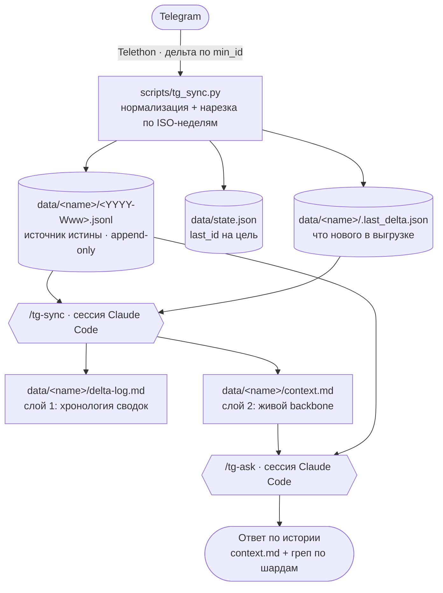

# Telegram Chat Digest

Следит за выбранными чатами Telegram, инкрементально выгружает **только новые**
сообщения и силами сессии **Claude Code** ведёт по каждому чату живой контекст и
отвечает на вопросы по истории. Отдельный LLM-API-ключ не нужен — суммаризацию и
Q&A делает агент через слэш-команды.

Подходит для любых чатов, за которыми хочется держать «связную память»: рабочие
группы, комьюнити, проектные обсуждения, чаты по интересам.

## Что умеет

- **Дайджест дельты** — на каждом запуске тянет новые сообщения и дописывает
  хронологию изменений (`delta-log.md`) по каждому чату.
- **Живой контекст** — поддерживает `context.md`: участники, активные темы,
  принятые решения, открытые вопросы, договорённости. Это backbone для ответов.
- **Q&A по истории** — отвечает на вопросы, опираясь на `context.md` и точечный
  греп по сырым сообщениям, со ссылками на `#id`.
- **Обзор активности** — таблица по всем группам за последние N дней (кто активен,
  упоминания вас, ответы) — чтобы решить, какие чаты взять в отслеживание.

## Как это устроено



Раскладка репозитория:

```text
config.yaml            список целей (чат, топик)
.env                   секреты Telegram (не в git)
secrets/tg.session     сессия Telethon (не в git)
scripts/
  tg_sync.py           выгрузка дельты -> недельные шарды + state.json + .last_delta.json
  tg_overview.py       обзор активных групп за N дней (--days)
  tg_discover.py       N последних диалогов -> config.discovered.yaml (кандидаты в цели)
  import_export.py     разовый сидинг из ручного экспорта Telegram Desktop
  migrate_to_weekly.py разовая миграция старого raw.jsonl -> недельные шарды
data/                  рантайм-данные, НЕ в git (формат см. в examples/)
examples/
  team-platform/       синтетический пример всех артефактов (вымышленные данные)
.claude/commands/      слэш-команды: tg-sync, tg-ask, tg-overview
```

## Модель данных

- **Хранение** — append-only JSONL по паре **(чат, топик)**, нарезка на **недельные
  шарды** `data/<name>/<YYYY-Www>.jsonl` по ISO-неделе даты сообщения (UTC). Одна
  дельта на стыке недель пишется сразу в два файла. Это источник истины.
- **Аналитика** — eager, два слоя: на каждом sync дописывается `delta-log.md`
  (хронология) и мерджится `context.md` (живой общий контекст).
- **Только новые сообщения** — дельта по `min_id`; правки/удаления/реакции после
  выгрузки сознательно не догоняем (учитывайте это при вопросах, чувствительных к
  актуальности).

Формат всех артефактов на живом (вымышленном) примере — в
[`examples/team-platform/`](examples/team-platform/).

## Установка (один раз)

1. Зависимости (любой из вариантов):

   ```bash
   python3 -m venv .venv && source .venv/bin/activate
   pip install -r requirements.txt      # или: pip install -e .
   ```

2. Получите `api_id` / `api_hash` на <https://my.telegram.org> → *API development tools*.
3. Скопируйте секреты и заполните:

   ```bash
   cp .env.example .env      # впишите TG_API_ID, TG_API_HASH, TG_PHONE
   ```

4. Пропишите свои чаты в `config.yaml` (поле `chat` принимает `@username`,
   числовой id или точное название чата; `topic` — id корневого сообщения топика
   или `null`).
5. Первый запуск выполнит интерактивный логин (код из Telegram, при необходимости
   2FA). Запускайте **питоном из venv** (иначе `ModuleNotFoundError: telethon`):

   ```bash
   .venv/bin/python scripts/tg_sync.py
   ```

   Сессия сохранится в `secrets/tg.session`, дальше логин не нужен.

> Опционально историю за прошлый период можно засеять из ручного экспорта
> Telegram Desktop (`scripts/import_export.py`) — тогда `last_id` проставится и
> первая выгрузка подтянет только новые сообщения.

## Использование

В сессии Claude Code в этой папке:

- `/tg-sync` — выгрузить новые сообщения и обновить `context.md` + `delta-log.md`.
- `/tg-ask <вопрос>` — ответ по истории (Claude читает `context.md` как backbone и
  при необходимости грепает недельные шарды `data/<name>/*.jsonl`).
- `/tg-overview` — обзор всех групп/супергрупп, активных за последние N дней (флаг
  `--days`, по умолчанию 7). Таблица сохраняется в `data/_overview.md`.
- `/tg-discover [N]` — выгрузить N последних диалогов (по умолчанию 20) в
  `config.discovered.yaml` закомментированными целями; раскомментируйте нужные и
  перенесите в `config.yaml`. Файл в `.gitignore` (реальные имена/id чатов).

### Миграция со старого формата

Если остались данные в едином `data/<name>/raw.jsonl` (прежний формат), разрежьте
их на недельные шарды:

```bash
python3 scripts/migrate_to_weekly.py --dry-run   # показать план
python3 scripts/migrate_to_weekly.py             # выполнить (оригинал -> raw.jsonl.migrated)
```

## Безопасность данных

- `.env`, `secrets/`, `*.session` и **вся папка `data/`** — в `.gitignore`: это
  личные данные (сырые сообщения и производный от них контекст). В git попадает
  только синтетический `examples/`.
- User-session = ваш личный аккаунт Telegram: не коммитьте сессию, держите
  умеренную частоту запусков (FloodWait Telethon обрабатывает автоматически).
- В `.env.example` — только плейсхолдеры; реальные `api_id`/`api_hash`/телефон
  держите в `.env` (он не версионируется).

## Карта проекта (для агентов)

Короткие операционные правила — в [`AGENTS.md`](AGENTS.md). Ниже — что является
ядром и каких инвариантов держаться.

| Модуль | Роль |
|---|---|
| `scripts/tg_sync.py` | Инкрементальная выгрузка дельты по `min_id`; нарезка по недельным шардам; запись `state.json` и `.last_delta.json`. |
| `scripts/tg_overview.py` | Обзор активных групп за N дней (`--days`) с метриками. Самостоятелен, не пишет в `data/<name>/`. |
| `scripts/tg_discover.py` | N последних диалогов → `config.discovered.yaml` (закомментированные кандидаты в цели). Файл в `.gitignore`. |
| `scripts/import_export.py` | Разовый сидинг из экспорта Telegram Desktop (`result.json`) в недельные шарды. |
| `scripts/migrate_to_weekly.py` | Разовая миграция старого `raw.jsonl` → недельные шарды. |
| `.claude/commands/*.md` | Агентский слой: `/tg-sync`, `/tg-ask`, `/tg-overview`. |
| `config.yaml` | Список целей (чат, топик) + параметры выгрузки. |

**Инварианты — не нарушать:**

1. Реальные данные и секреты не версионируются (`data/`, `.env`, `secrets/`, `*.session`).
2. `*.jsonl` — append-only; недельная нарезка по ISO-неделе даты сообщения (UTC); единый `raw.jsonl` не возвращаем.
3. Только новые сообщения (дельта по `min_id`); правки/удаления не догоняем.
4. `context.md` мерджится, история не переписывается.
5. Логику `iso_week_of` дублируют `tg_sync.py`, `import_export.py`, `migrate_to_weekly.py` — менять согласованно.

**Чего здесь нет осознанно:** отдельного LLM-API-клиента (суммаризацию и Q&A
делает сессия Claude Code), базы данных (хранилище — плоские JSONL), догона
правок/удалений/реакций после выгрузки.
